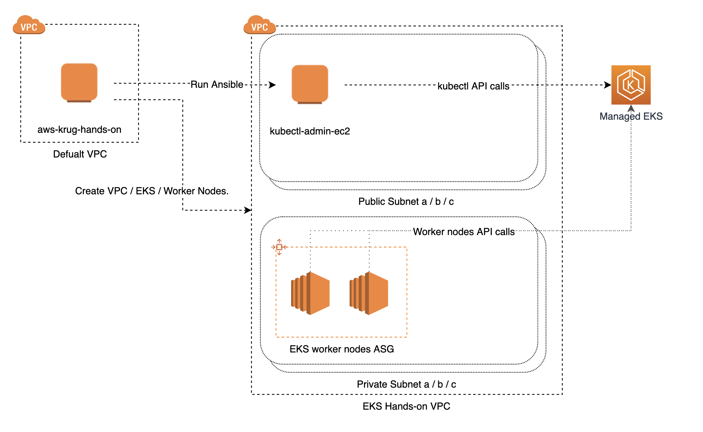

# EKS 톺아보기. (아마도...part 1)
Kubernetes 가 화두가 된지는 이미 조금 되었지만, AWS의 EKS를 주제로 실제 사용한 경험을 바탕으로 hands-on을 포함하여 진행한 모임은 많지 않아 준비해 보았습니다.

이미 온라인에는 EKS workshop 에 촛점이 맞춰진 hands-on 자료는 많습니다.
* [EKS Workshop](https://github.com/stevenshim/easy-ssh-ec2)
  * eksctl 명령어를 사용함.
* [aws-quickstart-amazon-eks](https://github.com/aws-quickstart/quickstart-amazon-eks)
  * cloudformation 을 사용함.

다만, 근래 많이 사용되고 있는 3rd party tools인  terraform과 ansible을 활용하여 EKS를 구축하는 workshop을 준비하였습니다.

기존에 흔히 접하는 workshop에서는 설명이 자세하지 않았지만, 실제 환경을 운영중에 꼭 알아야 하는 놓칠 수 있는 정보들을 좀 더 자세히 보기로 했습니다.

이 자료는 아래의 지식을 필요로 합니다.
* AWS 의 EC2, VPC, IAM 등의 기본 지식과 실제 사용 경험
* Docker Container 의 기본 지식과 실제 사용 경험
* 3rd party tools (Terraform, Ansible) 의 기본 지식과 실제 사용 경험
* Kubernetes 관련 기본 지식

## 들어가며
이번 workshop 을 통해 EKS를 생성하는 과정을 서술한 Architeture 입니다.


## 1. 기본 환경 만들기
모든 사용자가 같은 환경에서 Terraform 과 Ansible 을 사용할 수 있도록 EC2를 하나 만들어 해당 EC2 내에서 진행합니다.

이 과정만큼은 수동으로 수행합니다.

### 1-1. EC2 생성하기
AWS EC2 Console 로 이동하여 default VPC 에 Hands-on 용 EC2 하나를 생성합니다.<br>
생성한 EC2는 아래 조건을 만족하도록 합니다.
* AMI - OS Amazon Linux 2 AMI 
* Instance type - t2.micro
* Public IP assigned (외부에서 접속 가능해야 함)
* Administrator 권한의 IAM Role 할당 (필요시 신규 생성, Role 이름 : aws-krug-admin)
* pem key 생성 (key 이름 : aws-krug-gudi)
* 이외 설정은 기본을 따라가도록 합니다.


### 1-2. EC2 접속하기
#### Mac / Linux 
EC2 접속 전 Mac / Linux PC 에서 할 일.
```bash
## pem 키 읽기 권한으로 변경
$ chmod 400 aws-krug-gudi.pem

## pem 키를 ssh pem list 에 추가 (접속 편하게 하려고 추가)
$ ssh-add aws-krug-gudi.pem 

## 접속하기. -A 옵션은 pem키를 해당 ec2까지 포워딩해서 넣는것
$ ssh -A ec2-user@<your-ec2-ip>
```

#### Windows
Putty로 접속 필요. 

가이드 문서: https://docs.aws.amazon.com/AWSEC2/latest/UserGuide/putty.html

**EC2 접속 후**

Putty를 통해 EC2 접속 이 후, pem 키를 복사함 (추후 Ansible에서 사용 예정)
```
## vim 등을 통해 EC2 생성 시 사용한 aws-krug-gudi.pem 키를 복사해서 만듬.
$ vim aws-krug-gudi.pem

## pem 키 읽기 권한으로 변경
$ chmod 400 aws-krug-gudi.pem

## pem 키를 ssh pem list 에 추가 (접속 편하게 하려고 추가)
$ ssh-add aws-krug-gudi.pem 
```

### 1-3 Terraform, Ansible, Git 설치하기
#### Terraform 설치하기
```
$ curl https://releases.hashicorp.com/terraform/0.12.8/terraform_0.12.8_linux_amd64.zip -o terraform.zip

$ unzip terraform.zip

$ sudo mv terraform /usr/local/bin/terraform

$ sudo ln -s /usr/local/bin/terraform /usr/local/bin/tf

$ rm terraform.zip

$ tf version
```

#### Ansible 설치하기
```
$ curl https://bootstrap.pypa.io/get-pip.py -o get-pip.py

$ sudo python get-pip.py

$ sudo pip install ansible

$ rm get-pip.py

$ ansible --version
```

#### git, vim, telnet, tmux 설치하기
```
$ sudo yum install git vim telnet tmux -y
```

### 1-4 Source Code 받기
```
$ git clone https://github.com/stevenshim/eks-hands-on.git
```

### 1-5 준비단계 마무리 
여기까지 EKS 설치 전, 동일한 환경에서 진행하기 위해 EC2에 Terraform과 Ansible 을 설치하고 Source Code를 받았습니다.


## 2. Terraform 으로 EKS 구성하기

### 2-1. Terraform Initialize 하기
```
$ tmux

$ cd eks-hands-on/terraform/eks

### terraform initialize 과정. 느릴 땐 수 분 소요. 
$ tf init
```

### 2-2. Terraform 로컬 변수 파일 만들기
Vim 을 이용해 아래와 같은 내용의 파일을 만듭니다.

<EC2_ASSIGEND_ADMIN_ROLE_NAME> 부분은 여러분이 EC2 생성할 때 사용한 이름과 동일한 것으로 대체합니다.

파일 이름 : local.tfvars
```
aws_krug_admin_role = "<EC2_ASSIGEND_ADMIN_ROLE_NAME>"
```

### 2-3. Terraform Plan 보기
```
$ tf plan -var-file local.tfvars
~~~
~~~
~~~

Plan: 40 to add, 0 to change, 0 to destroy.

------------------------------------

Note: You didn't specify an "-out" parameter to save this plan, so Terraform
can't guarantee that exactly these actions will be performed if
"terraform apply" is subsequently run.
```

### 2-4. Terraform 으로 EKS 생성하기
작성된 Terraform 은 아래 리소스를 생성합니다.
* VPC (NatGateway 포함)
* kubectl 명령을 수행할 서버
* EKS Cluster (1.14)
* EKS Worker node 2대 (Autoscaling Group)
* 위와 관련된 IAM Role 등

총 소요시간은 약 15분 내외입니다.

```
$ tf apply -var-file local.tfvars
```

### 2-5. Ansible 로 kubectl 설정하기

```
## Directory 이동
$ cd ../../ansible

$ chmod 755 ansible_helper.sh

## 수 분 소요
$ ./ansible_helper.sh
```

### 2-6. kubectl 서버에 접속하기.
EC2 Console 에 보면 'awskrug_gudi-kubectl' 라는 이름의 EC2 가 생성된걸 볼 수 있습니다.

먼저, 이 EC2 의 방화벽에 규칙을 추가하여 여러분의 PC에서 22 port 접속이 가능하게 합니다.

이 후 EC2 에 접속하여 아래와 같이 EKS 상태를 봅니다.

<YOUR_kubectl_EC2_IP> 는 여러분의 EC2 IP를 넣습니다.
```
$ ssh ubuntu@<YOUR_kubectl_EC2_IP>

$ sudo su -

$ k get no
NAME                                               STATUS   ROLES    AGE     VERSION
ip-172-16-10-185.ap-northeast-2.compute.internal   Ready    <none>   5m41s   v1.14.6-eks-5047ed
ip-172-16-12-159.ap-northeast-2.compute.internal   Ready    <none>   5m41s   v1.14.6-eks-5047ed
```

## 3. EKS 생성 과정 들여다보기
이번 파트는 terraform 코드와 함께, EKS를 생성하는 과정에서 순수 Kubernetes와는 상관없이 AWS EKS에서 꼭 필요한 내용들을 다룹니다.

### 3-1. VPC Tags 설정하기
EKS Cluster의 Master Plane이 VPC 나 Subnet 등을 찾기 위해서는 아래처럼 tag를 꼭 달아야 합니다.

EKS와 함께 ELB 를 사용하는 경우에는, tag에 elb 관련 내용도 추가할 수 있습니다.

Public Subnet 인 경우엔 External ELB 를, Private Subnet 인 경우 Internal ELB 를 사용한다는 것을 명시하면 EKS가 명시된 Subnet과 동작하며 전체 subnet 을 순차 조회하지 않는다고 합니다.

```
resource "aws_subnet" "vpc_public_subnets" {
  count = length(var.vpc_public_subnets)
  vpc_id = aws_vpc.vpc.id
  cidr_block = lookup(var.vpc_public_subnets[count.index], "cidr")
  availability_zone = lookup(var.vpc_public_subnets[count.index], "az")

  tags = {
    Name = "${var.vpc_name}-${lookup(var.vpc_public_subnets[count.index], "name")}"
    Managed_by = "terraform"
    "kubernetes.io/cluster/${var.eks_cluster_name}" = "shared"
    "kubernetes.io/role/elb" = "1"
  }
}

resource "aws_subnet" "vpc_private_subnets" {
  count = length(var.vpc_private_subnets)
  vpc_id = aws_vpc.vpc.id
  cidr_block = lookup(var.vpc_private_subnets[count.index], "cidr")
  availability_zone = lookup(var.vpc_private_subnets[count.index], "az")

  tags = {
    Name = "${var.vpc_name}-${lookup(var.vpc_private_subnets[count.index], "name")}"
    Managed_by = "terraform"
    "kubernetes.io/cluster/${var.eks_cluster_name}" = "shared"
    "kubernetes.io/role/internal-elb" = "1"
  }
}
```

관련 문서 : https://docs.aws.amazon.com/eks/latest/userguide/network_reqs.html#vpc-tagging

### 3-2. Worker Node 최적화 AMI 사용하기
AWS EKS 에는 미리 준비된 최적화된 Worker Node AMI 가 있습니다. 이를 사용하는 편이 번거로운 작업을 줄여줍니다.

만약 직접 처음부터 Worker Node를 구성하고 싶다면 공개된 [소스코드](https://github.com/awslabs/amazon-eks-ami) 를 참고하세요.

**주의사항**<br>
EKS Worker Node AMI 는 AWS 에서 계속 업데이트 중입니다. <br>
EKS major.minor 버전에 맞는 최신 AMI 가 나왔더라도, 기존 cluster 와 완벽히 호환되지 않을 수도 있습니다.<br>
따라서 EKS Worker Node 에 사용하는 ami-id 는 terraform 을 사용 하더라도 가급적 static 하게 관리하는편이 좋습니다.

관련 문서 (영문 페이지로 볼 것!!): https://docs.aws.amazon.com/eks/latest/userguide/eks-optimized-ami.html


### 3-3. Worker Node EC2 에 Tag 달기
VPC 나 Subnet 등과 마찬가지로 EKS Master plane 이 Worker Node EC2 들을 탐색하려면 EC2에도 Tag 가 필요합니다.

```
resource "aws_autoscaling_group" "eks_worker_nodes_asg" {
  launch_configuration = aws_launch_configuration.eks_worker_nodes_lc.id
  desired_capacity = lookup(var.eks_worker_nodes_asg_group, "desire")
  min_size = lookup(var.eks_worker_nodes_asg_group, "min")
  max_size = lookup(var.eks_worker_nodes_asg_group, "max")
  name = "${aws_eks_cluster.eks_cluster.name}-worker"
  vpc_zone_identifier = [
    var.vpc_private_subnet_ids[0],
    var.vpc_private_subnet_ids[1],
    var.vpc_private_subnet_ids[2]
  ]

  tag {
    key = "Name"
    value = "${aws_eks_cluster.eks_cluster.name}-worker"
    propagate_at_launch = true
  }

  tag {
    key = "Managed_by"
    value = "terraform"
    propagate_at_launch = true
  }

  tag {
    key = "kubernetes.io/cluster/${aws_eks_cluster.eks_cluster.name}"
    value = "owned"
    propagate_at_launch = true
  }

  depends_on = [
    "aws_launch_configuration.eks_worker_nodes_lc"
  ]
}
```

### 3-5. AWS VPC CNI Plugin 설치하기
AWS VPC CNI Plugin 은 EKS의 Pod가 VPC ENI로부터 secondary IP를 할당받아 Pod 와 연결을 합니다.

관련 문서
* https://github.com/aws/amazon-vpc-cni-k8s
* https://docs.aws.amazon.com/eks/latest/userguide/pod-networking.html

### 3-6. EKS와 RBAC 권한
EKS의 권한 관리는 AWS IAM Authenticator for AWS를 통해 IAM과 연결됩니다. <br>
EKS를 최초 생성할 땐, 생성할 당신의 IAM User 혹은 IAM Role 만이 EKS Cluster 에 인증 및 권한 취득이 가능합니다. 

이번 Workshop 에서는 Terraform 을 통해서 EKS 를 생성하였고, Terraform 을 수행한 서버는 IAM Role (aws-krug-admin) 을 사용하였습니다. <br>
RBAC에 다른 IAM User 나 Role을 추가하기 전 까지는 aws-krug-admin Role 만이 EKS Master에 명령 수행이 가능합니다.

이 Workshop에서는 Kubectl 명령을 수행할 서버에 aws-krug-admin Role 을 할당하여 진행합니다.

**Terraform 코드**<br>
kubectl 명령을 수행할 EC2에 iam_instance_profile 을 EKS 생성한 서버와 같은것을 할당 함.
```
resource "aws_instance" "kubectl" {
  iam_instance_profile = var.aws_krug_admin_role
  associate_public_ip_address = true
  ami = var.kubectl_image_id
  subnet_id = var.vpc_public_subnet_ids[0]
  instance_type = "t3.micro"
  key_name = var.kubectl_ec2_keypair
  vpc_security_group_ids = [
    aws_security_group.kubectl_sg.id
  ]
  ebs_optimized = true

  tags = {
    Name = "${var.project_name}-kubectl"
    Managed_by = "terraform"
    Instance = "kubectl"
  }
}
```

**Ansible 코드**<br>
Ansible 을 이용해 kubectl 명령을 수행 할 서버에 aws-iam-authenticator 를 설치함.
```
- name: Download & install aws-iam-authenticator binary.
  get_url:
    url: https://amazon-eks.s3-us-west-2.amazonaws.com/1.14.6/2019-08-22/bin/linux/amd64/aws-iam-authenticator
    dest: /usr/bin/aws-iam-authenticator
    mode: 0755
```

관련 문서 : https://docs.aws.amazon.com/eks/latest/userguide/managing-auth.html

### 3-7. kubeconfig 설정 업데이트 하기
kubectl 명령어 툴을 사용하려면, EKS Master plane 에 대한 정보가 업데이트 되어야 합니다. <br>
AWS 는 awscli 를 통해 손쉽게 업데이트 할 수 있게 지원하고 있습니다.

**Ansible 코드**
```
- name: Create a kubeconfig for Amazon EKS
  command: aws eks update-kubeconfig --name {{ eks_cluster_name }}
```

kubeconfig 설정은 ~/.kube 경로에 저장됩니다.

관련 문서 : https://docs.aws.amazon.com/eks/latest/userguide/create-kubeconfig.html

### 3-8. Worker Node가 잘 동작하지 않을 때, 디버깅 하기
EKS Worker node 에도 kubelet 이 동작합니다. 
만약, worker node 가 정상적으로 EKS Master Plane에 연결되지 못 한다면, Worker node 의 log에서 힌트를 찾을 수 있을지도 모릅니다.

**준비한 Worker node 한 대에 ssh로 접속**
```
## kubelet 관련 로그 보기
$ sudo tail -f /var/log/message | grep kubelet
```
관련 문서 : https://docs.aws.amazon.com/eks/latest/userguide/troubleshooting.html

### 3-9. VPC Subnet 크기 고려하기
AWS EKS 에서 AWS VPC CNI Plugin 을 사용하는 경우, 생성되는 Pod 의 개수만큼 ENI로부터 private ip도 할당 받습니다.<br>
이는 Subnet 마다 할당할 수 있는 최대 IP 개수와 관련이 있는데, Subnet의 크기를 작게 설계한다면 Pod 생성이 어려울 수 있습니다.<br>
Pod 가 생성될 수 있는 예상 개수를 넉넉히 고려하여 Subnet 크기를 정하도록 합니다.<br>
* 하나의 Pod는 비교적 EC2 보다는 작은 단위로 배포될 가능성이 높기 때문에 EC2로 서비스를 운영 할 때 보다, 최소 2~3배 이상 많은 양의 Pod가 배포될 것이라고 가정 하는 편이 좋음.

### 3-10. EC2 Type 별 Pod 최대 생성 개수 확인
AWS VPC CNI Plugin 의 경우 Pod 마다 ENI 로부터 Private IP를 할당받게 됩니다.<br>
이는, EC2 마다 Pod 생성 개수의 물리적 한계가 있음을 말합니다.<br>
모든 EC2는 Instance Type 별로, 최대 ENI 할당 개수와 IP 할당 개수가 다르게 정해져 있습니다.<br>

아래 관련 문서를 보고 EC2 별 Pod 최대 생성 개수를 파악하도록 합니다.

관련 문서
<br>
https://docs.aws.amazon.com/AWSEC2/latest/UserGuide/using-eni.html#AvailableIpPerENI
<br>
https://github.com/awslabs/amazon-eks-ami/blob/master/files/eni-max-pods.txt

