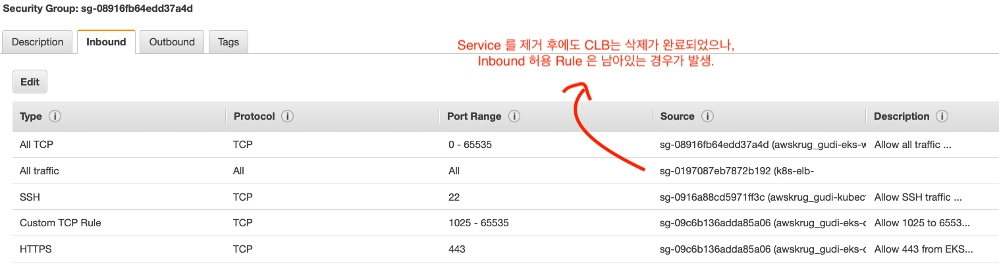
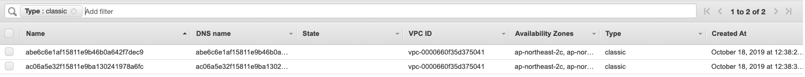
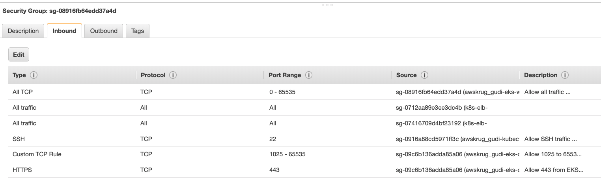

## 2. Loadbalancer Type Services
Amazon EKS 는 Kubernetes 의 Service Type Resource 로 사용할 수 있도록 2가지 Load Balancer 를 지원합니다. <br> 
* Network Load Balancer (NLB)
* Classic Load Balancer (CLB)


**NOTE**<br>
Application Load Balancer (ALB) 는 Ingress Type Resource 로 지원합니다.


**관련 자료**
- [EKS Load Balancing](https://docs.aws.amazon.com/en_pv/eks/latest/userguide/load-balancing.html)


### 2-1. Service Type Resource에 Classic Load Balancer 사용하기
아래 clb-service.yaml 파일을 작성합니다.
```
apiVersion: v1
kind: Service
metadata:
  labels:
    app: aws-krug-clb
  name: aws-kurg-clb
spec:
  ports:
    - port: 80
      protocol: TCP
  selector:
    app: aws-krug
  sessionAffinity: None
  type: LoadBalancer
```
```
$ k apply -f clb-service.yaml
service/aws-kurg-clb created
```

<Br>

#### CLB가 생성되지 않은 상태로 멈출 때
Serviec 를 생성하였지만 Pending 상태로 멈춰있는 경우.<br>
Subnet 의 Tag 가 EKS Cluster 이름과 같은지, elb 할당 관련 Tag가 있는지, 오탈자가 있는지 등 잘 확인해보길 바랍니다.
```
$ k get svc
NAME       TYPE           CLUSTER-IP       EXTERNAL-IP   PORT(S)        AGE
aws-krug-clb   LoadBalancer   10.100.197.169   <pending>     80:31397/TCP   5m1s


$ k describe svc
...
...
Events:
  Type     Reason                      Age                From                Message
  ----     ------                      ----               ----                -------
  Normal   EnsuringLoadBalancer        28s (x4 over 64s)  service-controller  Ensuring load balancer
  Warning  CreatingLoadBalancerFailed  28s (x4 over 64s)  service-controller  Error creating load balancer (will retry): failed to ensure load balancer for service krug/aws-kurg-clb: could not find any suitable subnets for creating the ELB
```

#### CLB가 재생성되지 않은 상태로 Event도 받지 않을 때
AWS EKS Bug로 판단되는데, 간혹 Worker Node의 Security Group의 Inbound에 CLB Security Group 허용 Record가 자동으로 삭제되지 않는 문제가 발생함.<br>



문제 증상: 
* CLB를 사용하는 Service Type Resource 를 삭제
* 삭제 시, CLB는 삭제가 정상적으로 되었으나, Security Group이 잔존함. (CLB용 SG 잔존, Worker Node SG에 Inbound Rule도 잔존)
* CLB를 사용하는 Service Type Resource 를 재생성
* 생성되지 않음.

<br>

해결:
* 수동으로 CLB가 생성했던 Security Group을 삭제하는 과정으로 해결 가능


### 2-2. CLB Service 여러개 만들어보기
이름을 변경하여 Service를 하나 더 생성해봅니다. 
```
apiVersion: v1
kind: Service
metadata:
  labels:
    app: aws-krug-clb2
  name: aws-kurg-clb2
spec:
  ports:
    - port: 80
      protocol: TCP
  selector:
    app: nginx
  sessionAffinity: None
  type: LoadBalancer
```
```
$ k apply -f clb-service2.yaml
service/aws-kurg-clb2 created

$ k get svc
NAME            TYPE           CLUSTER-IP      EXTERNAL-IP                                                                    PORT(S)        AGE
aws-kurg-clb    LoadBalancer   10.100.237.96   a8dcb47b5f15711e9ba130241978a6fc-1711756101.ap-northeast-2.elb.amazonaws.com   80:30605/TCP   3s
aws-kurg-clb2   LoadBalancer   10.100.26.131   a53480295f15711e9b46b0a642f7dec9-1189571686.ap-northeast-2.elb.amazonaws.com   80:31667/TCP   101s
```

ELB 메뉴에서 CLB 생성을 확인해봅니다.



그리고 Worker Node의 Security Group을 확인해봅니다.


다수의 Inbound Rules 이 하나의 Worker Node Security Group 에 생성된 것을 확인할 수 있습니다. 

**NOTE**
<br>
Service를 CLB 타입으로 사용하는 경우, Service 개수만큼 CLB가 생성됩니다. <br>
Security Group의 Rules 개수도 선형으로 증가하니 Limits check를 꼭 해야 합니다.

### 2-3. Service Type Resource에 Network Load Balancer 사용하기
NLB를 생성해서 사용하는 Service를 사용할 경우, 아래와 같이 Annotation 설정이 필요합니다.

nlb-service.yaml 파일을 만들어 적용합니다.
```
apiVersion: v1
kind: Service
metadata:
  annotations:
    service.beta.kubernetes.io/aws-load-balancer-type: nlb
  labels:
    app: aws-krug-nlb
  name: aws-kurg-nlb
spec:
  ports:
    - port: 80
      protocol: TCP
  selector:
    app: nginx
  sessionAffinity: None
  type: LoadBalancer
```
```
$ k apply -f nlb-service.yaml
service/aws-kurg-nlb created
```

### 2-4. Servicer Type Resource를 Internal ELB (CLB, NLB) 를 사용하기
```
apiVersion: v1
kind: Service
metadata:
  annotations:
    service.beta.kubernetes.io/aws-load-balancer-internal: 0.0.0.0/0
  labels:
    app: aws-krug-internal-clb
  name: aws-kurg-internal-clb
spec:
  ports:
    - port: 80
      protocol: TCP
  selector:
    app: nginx
  sessionAffinity: None
  type: LoadBalancer
```
```
$ k apply -f internal-service.yaml
service/aws-kurg-internal-clb created
```

**관련 문서**
* [Internal Load Balancer](https://docs.aws.amazon.com/en_pv/eks/latest/userguide/load-balancing.html)