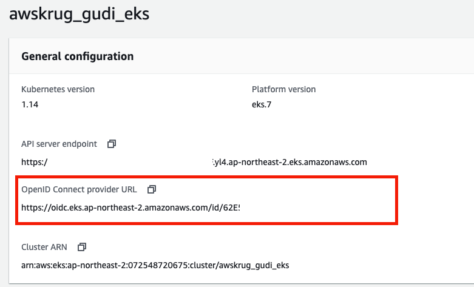

## 1. IAM Role for Service Account.
2019년 09월 AWS EKS 에서 강력하고 핵심이 되는 기능 중 하나인 IAM Role for Service Account 기능이 런칭되었습니다.

기존에는 Pod 에 필요한 IAM 권한을 할당하기 위해 아래와 같은 방법들을 취했었습니다.
* Worker Node 전체에 IAM 권한을 할당
* K8S Secret 에 Application 별 Access Key Pair 를 저장하고 Pod 에 Mount
* 3rd party open source tool ('kube2iam', 'kiam') 등을 활용

Worker Node 전체에 IAM 권한을 할당하면 제대로된 권한 관리가 되지 않습니다.<br>
K8S Secret 자체 목적이 Access Key Pair 를 관리하기에 적합한 리소스였지만, AWS 를 관리하는 입장에서 Access Key Pair 기반으로 권한 제어를 하는 것은 여간 부담스럽지 않을 수 없습니다.<br>
EKS 개발 로드맵에 IAM Role 을 Pod 에 할당하는 기능이 나오기 전까지는 'kube2iam' 이나 'kiam' 등을 이용해 대체하는 편이였습니다.

신규 기능은 IAM Role 권한을 정확히 원하는 Pod 에 할당할 수 있도록 개선되었고, 2019년 09월 이후, EKS 1.13 버전부터 지원됩니다. (2019/09 이전에 EKS 1.13 이상 버전을 설치한 경우 업그레이드 필요) 

사용하기 앞서 주의할 점은, 현재 사용중인 3rd party plugin  (alb-ingress-controller 나 cluster autoscaler 등) 버전이 이 기능을 지원하는지 자세히 확인해야 합니다. <br>
이들은 오픈소스로 제공되지만 EKS 에서 자주 사용되기도 합니다. EKS 팀이 적극적으로 지원하더라도 3rd party plugin 은 다양한 이유로 지원이 늦어질 수 있습니다.


관련 문서: 
- [AWS Blog Announce - IAM Role for Service Account](https://aws.amazon.com/blogs/opensource/introducing-fine-grained-iam-roles-service-accounts/)
- [AWS Docs - IAM Role for Service Account](https://docs.aws.amazon.com/eks/latest/userguide/iam-roles-for-service-accounts.html)

### 1-1. EKS 가 IAM Role for Service Account 사용 활성화 하기

EKS 1.14 버전부터는 자동으로 활성화 되어있습니다. <br>
2019/Sept/03 이 후 EKS 1.13 버전으로 업데이트 한 경우 활성화가 가능합니다. <br> 

아래와 같이 EKS Console 에서 OpenID Connect URL 이 연결되어 있는지 확인합니다.

 

### 1-2. IAM Identity Provider 생성하기

IAM 콘솔에서 Identity Providers (IdP) 로 이동하여 신규 OIDC Provider 를 생성합니다.

* Provider Type 은 ODIC 로 설정
* Provider URL 은 1-1에서 확인한 OpenID Connect URL 로 설정
* Audience 는 'sts.amazonaws.com' 으로 설정

Console 에서는 IdP 생성할 때 CA Thumbprint 를 자동으로 생성하여 입력이 됩니다.<br>  
하지만 Terraform 과 같은 3rd party tool 을 이용하여 IdP 를 생성하는 케이스는 직접 ROOT CA 에 대한 Thumbprint(fingerprint) 를 만들어야 합니다.<br>
* 관련 문서 [Obtaining the Root CA Thumbprint for an OpenID Connect Identity Provider
](https://docs.aws.amazon.com/IAM/latest/UserGuide/id_roles_providers_create_oidc_verify-thumbprint.html) 를 참고

관련 문서:
- [Enabling EKS IAM Role for Service Account](https://docs.aws.amazon.com/eks/latest/userguide/enable-iam-roles-for-service-accounts.html)
- [Obtaining the Root CA Thumbprint for an OpenID Connect Identity Provider
](https://docs.aws.amazon.com/IAM/latest/UserGuide/id_roles_providers_create_oidc_verify-thumbprint.html)
- [Terraform Github ticket - pending](https://github.com/terraform-providers/terraform-provider-aws/pull/10217)


### 1-3. 샘플 IAM Role 만들기

Terraform 을 이용해서 S3 full access 가 가능한 Sample IAM Role 을 만듭니다.

#### Terraform IAM Role resource 생성
~/terraform/eks/modules/iam/iam_sample_role.tf 참고.

```yaml
resource "aws_iam_role" "iam_service_account_sample_role" {
  name = "iam_service_account_sample_role"
  assume_role_policy = data.template_file.iam_service_account_sample_role_trust_relationship.rendered
}

resource "aws_iam_role_policy" "eks_alb_ingress_controller_policy" {
  name = "eks_alb_ingress_controller_role"
  role = aws_iam_role.iam_service_account_sample_role.id
  policy = file("${path.module}/templates/iam_service_account_sample_role_policy.json")
}

data "template_file" "iam_service_account_sample_role_trust_relationship" {
  template = file("${path.module}/templates/iam_service_account_sample_role_trust_relation.json.tpl")

  vars = {
    aws_iam_openid_connect_provider_arn = aws_iam_openid_connect_provider.oidc_iam_provider.arn
    aws_iam_openid_connect_provider_url = aws_iam_openid_connect_provider.oidc_iam_provider.url
    alb_ingress_controller_namespace = var.alb_ingress_controller_namespace
  }
}
```

#### Trusted Relationship 설정

Trust Relationship 정책 내용에는 인증 가능한 Namespace, Service Account 등 범위 지정이 가능합니다.

```json
{
  "Version": "2012-10-17",
  "Statement": [
    {
      "Effect": "Allow",
      "Principal": {
        "Federated": "${aws_iam_openid_connect_provider_arn}"
      },
      "Action": "sts:AssumeRoleWithWebIdentity",
      "Condition": {
        "StringLike": {
          "${aws_iam_openid_connect_provider_url}:sub": "system:serviceaccount:default:*"
        }
      }
    }
  ]
}
```

### 1-4. 샘플 Service Account 를 만들기

sample-sa.yml 파일을 복사해서 service account 를 만듭니다.
```bash
kubectl apply -f sample-sa.yml

kubectl get sa
```
sample-pod.yml 파일을 복사해서 pod 를 만듭니다.
```bash
kubectl apply -f sample-pod.yml

kubectl get pod kubia -o yaml
```

pod 의 자세한 정보를 보면 service account 에 IAM 과 관련된 jwt token 이 inject 된걸 볼 수 있습니다.
```bash
kubectl get pod kubia -o yaml
```

```yaml
...
    volumeMounts:
    - mountPath: /var/run/secrets/kubernetes.io/serviceaccount
      name: sample-sa-token-hxc2w
      readOnly: true
    - mountPath: /var/run/secrets/eks.amazonaws.com/serviceaccount
      name: aws-iam-token
      readOnly: true
...
```

Pod 내부에서 s3에 접근이 가능한지 테스트 해봅니다.
```bash
kubectl exec -it kubia /bin/bash -n default

curl https://bootstrap.pypa.io/get-pip.py -o get-pip.py
python get-pip.py
pip install awscli
aws s3 ls
...

```

관련 문서:
- [Create a IAM Role](https://docs.aws.amazon.com/eks/latest/userguide/create-service-account-iam-policy-and-role.html)
- [JWT Token rfp docs](https://tools.ietf.org/html/rfc7519#page-9)
